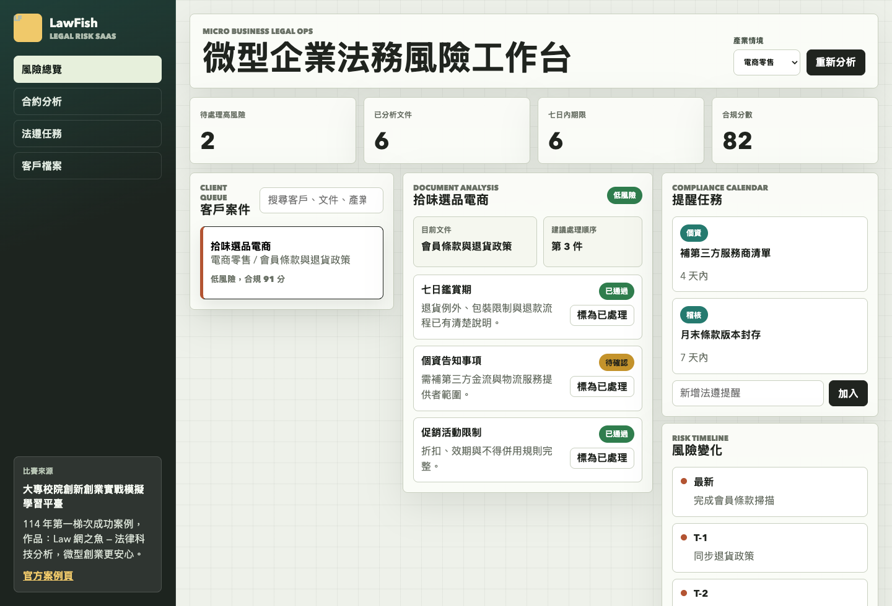
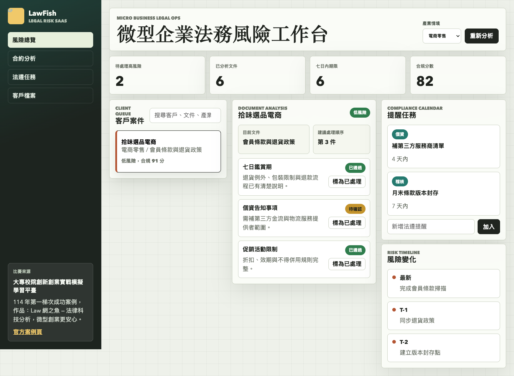

# LawFish 法律科技 SaaS 原型

## 快速看懂

- 線上 Demo：https://atlasforcn.github.io/startup-lawfish-legaltech/
- 這個原型在做什麼：把 Law 網之魚做成面向新創與微型企業的法律輔助工作台。
- 特色定位：把官方案例提到的商標、專利、契約、法規資訊與訴願類案建議，轉成可操作的風險處理流程。
- 操作流程：切換服務模組與客戶案例 → 檢視官方脈絡、風險條款與系統建議 → 標記已處理 → 自動新增追蹤任務並留下時間線紀錄

展開完整功能流程截圖

## 比賽來源

- 競賽：大專校院創新創業實戰模擬學習平臺
- 屆次：114 年第一梯次成功案例
- 得獎作品：Law 網之魚 — 法律科技分析，微型創業更安心
- 學校：國立政治大學
- 類別：資通訊領域 ICT
- 官方來源：https://ssp.moe.gov.tw/cases/1398

## 核心概念

依官方案例描述，本原型將「多元法律輔助系統」轉譯成給新創與微型企業使用的法律科技 SaaS：智財風險、契約解讀、營運法規、訴願類案與處理後追蹤都集中在同一個工作台。

## 功能

- 依服務模組切換商標風險、專利比對、契約解讀、法規諮詢與訴願類案
- 擴充 7 個案例，對應官方頁提到的智財、法務、資料來源與多模態邊界
- 每個風險條款提供系統建議與處理後追蹤事項
- 「標為已處理」會降低風險、停用按鈕、新增追蹤任務並寫入時間線
- 儀表板統計未處理高風險、案例文件、追蹤任務與平均合規分

## 聲明

本 repo 是依官方公開成功案例建立的概念原型，不代表原團隊授權產品，也未使用原團隊商標、素材或未公開資料。

## 8 位專家補強

- 使用者與痛點：微型企業需要整理常見法務風險，但難以判斷何時必須找律師。
- 市場與差異：替代方案是搜尋、範本與法律諮詢；差異在問題整理、依據提示與轉介。早期客群從創業育成場域導入，採購者可為園區或企業服務單位。
- 驗證：記錄場域完成率、風險清單採用、律師轉介、錯誤回饋、處理時間與後續成效指標。
- 商業模式：組織訂閱、企業導入與律師合作服務；收入、內容維護、專業複核與客服成本需報價驗證。
- 專業邊界：本工具不可取代律師或其他法律專業人員，不構成法律意見；高風險事項必須人工複核並尋求正式諮詢。
